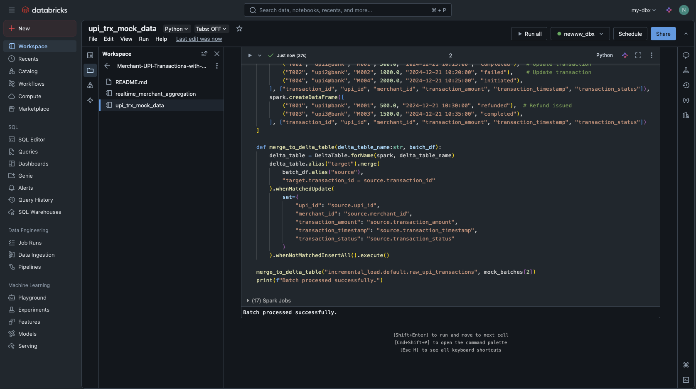
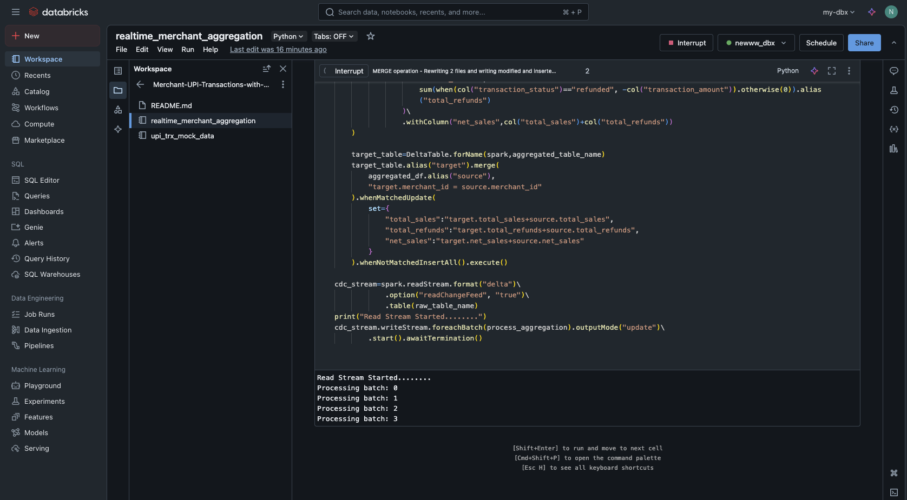
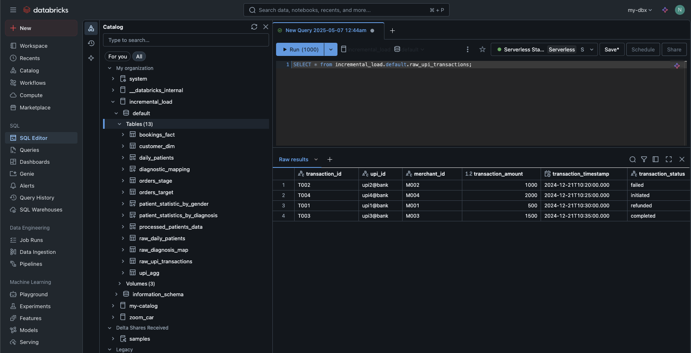
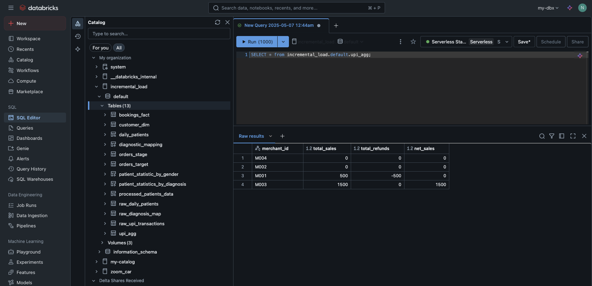

# 🏦 Merchant UPI Transactions with CDC & Real-Time Aggregation

This project simulates and processes merchant UPI transaction data with Change Data Capture (CDC) semantics and real-time aggregation using PySpark. It showcases a mini end-to-end data engineering pipeline, suitable for streaming-based analytics platforms.

---

## 📌 Objective

- Simulate UPI transactions and generate batch CDC mock data.
- Perform real-time aggregation using Spark Structured Streaming.
- Visualize the ingestion and aggregation process.

---

## 📁 File Overview

| File | Description |
|------|-------------|
| `upi_trx_mock_data.ipynb` | Generates mock UPI transaction records with CDC flags (`insert`, `update`, `delete`). |
| `realtime_merchant_aggregation.ipynb` | Reads CDC-enabled transaction data and computes running aggregates (e.g., total amount by merchant). |
| `screenshots/` | Contains visuals of pipeline stages, batch ingestion, and streaming metrics. |

---

## 🧪 Technologies Used

- **Apache Spark** (Structured Streaming)
- **Python** (PySpark)
- **Delta Lake** (assumed for data mutability and CDC)
- **Jupyter Notebooks**

---

## 🖼️ Screenshots

### Batch Processing Snapshot

### Streaming Job Execution

### Raw CDC Events

### Aggregated Results

---

## 🚀 How to Run

1. Ensure you have Apache Spark with Delta Lake support.
2. Open `upi_trx_mock_data.ipynb` and generate sample transaction data.
3. Run `realtime_merchant_aggregation.ipynb` to perform real-time analysis.

---

## 📊 Output

- Aggregated transaction amount by merchant
- Real-time updates using watermarking and windowing
- CDC operations handled within Spark stream

---

## 📬 Contact

For suggestions or feedback, feel free to open an issue or reach out!
